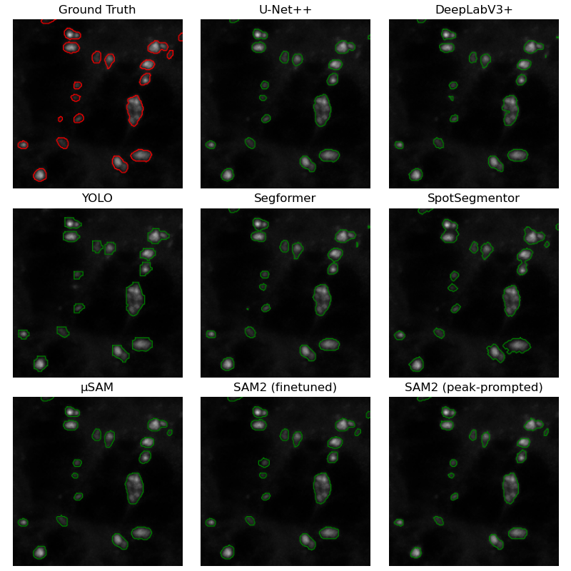

# AutoSpot

Welcome to **AutoSpot**, a project focused on detecting and segmenting Atg8 spots in fluorescence microscopy images for autophagy research. This repository documents the code and methodologies developed during the master's thesis in Computational Bioscience at the University of Oslo with the follwong title:

 **"Combining Traditional Image Analysis and Deep Learning for Enhanced Atg8 Spot Analysis in Autophagy Research."**

The primary objective of this project was to develop a method for the automatic identification and extraction of mCherry-tagged Atg8 spots from fluorescent images of Drosophila melanogaster larval cells, as illustrated by the example images provided below.

## Repository Structure

This repository is organised into several folders, each containing specific codes and functionalities:

- **cell_segmentation**: This folder documents the work to perform cell segmentation of Drosophila melanogaster larval cells.

- **cellular_dataset**: This folder documents the work performed on another dataset, the Cellular dataset. This dataset was later exchanged with new in-vivo data, and the work from this folder was not included in the final thesis.

- **create_dataset**: This folder includes scripts for preparing the fluorescence microscopy images for analysis. It contains codes to divide images into patches, extract bounding boxes, and perform initial analyses of the ground truth dataset.

- **peak_detection**: In this section, you will find codes for performing peak detection utilising the 'mountains' and 'SpotSegmentor' algorithms.

- **spot_detection**: This folder features scripts for object detection using the YOLO11 model, enabling the identification of relevant spots within microscopy images.

- **spot_segmentation**: Here, you can access various codes for spot segmentation, employing multiple models including SAM2, micro-SAM, U-Net++, YOLO11, DeepLabV3+, Segformer, and SpotSegmentor.

We have also include several notebooks that were created throughout the project, often in preparation for group meetings. These notebooks do not necessary include any final results but they show some of the work process along the way.
 
Thank you for taking the time to explore AutoSpot. 

