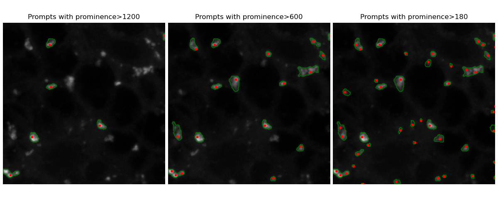

## Atg8 Spot Segmentation using SAM2
This repository contains code to apply the SAM2 model on fluorescent microscopy data to segment Atg8 peaks in intensity images.

### Installation of micro-SAM
We run the SAM2 model through the micro-SAM library. To get started, you will need to install micro-SAM, which can be found at the following URL: https://github.com/computational-cell-analytics/micro-sam

### Preparing Images
The SAM2 model expects images with bit-depth of 8 bits. Since the Atg8 spots are small, we have used patches instead of full frames. All models have been trained on patches of 256*256 pixels.

### Running the Analysis
The code folder contains scripts to perform segmentation using the AMG functionality of SAM2, where the results are post-processed to clean up low-quality masks. We have tested both finetuned vit_b model and the original vit_b model, with either the default prompt grid or peaks as prompts. The peaks were found using the peak detection program 'mountains'.

| Model                    | \gls{iou} | F1 Score | Precision | Recall | Balanced Accuracy |
|--------------------------|-----------|----------|-----------|--------|-------------------|
| SAM2 (finetuned)   | 0.60      | 0.71     | 0.70      | 0.81   | 0.90              |
| SAM2 (peak-prompted) | 0.58      | 0.72     | 0.79      | 0.69   | 0.84              |

**Performance metrics for SAM2 models compared to GT dataset.**

### Visualization and Performance
The Python scripts included in this repository assist with visualizing and evaluating the performance of the segmentation process. Since SAM2 is promptable, the Atg8 spots may be selected either manually or by some detection algorithm. Below is an example of segmentation masks (green lines) when different thresholds of prominence was used to select peaks (red dots).

### Further reading
More information about SAM2 code can be found at: https://github.com/facebookresearch/sam2